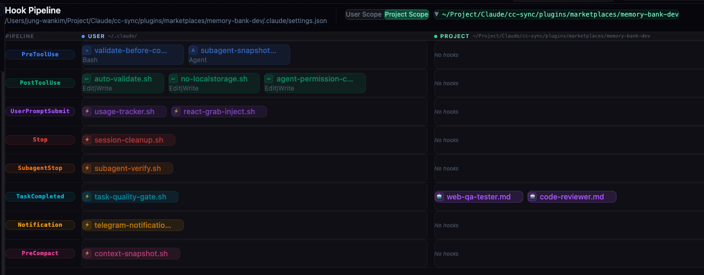
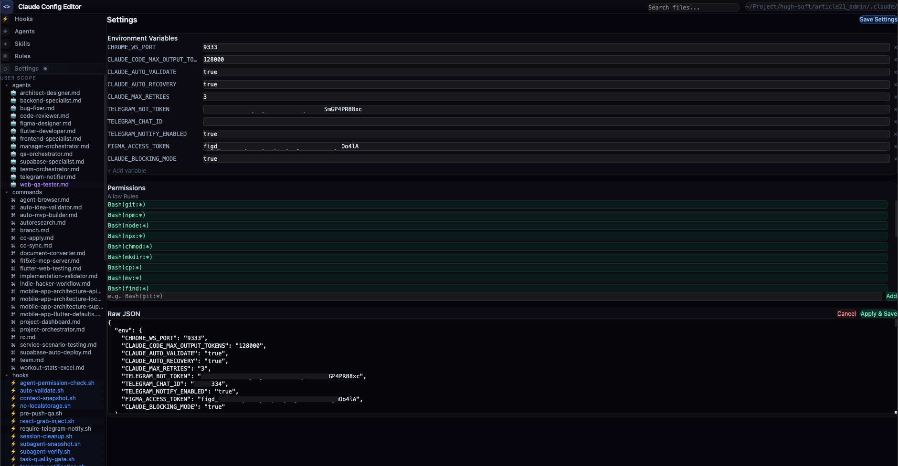

# Claude Config Editor

Claude Code의 설정 파일(`~/.claude/`)을 시각적으로 편집하는 웹 GUI 도구입니다.
Hooks, Agents, Skills, Rules, Settings를 직관적인 인터페이스로 관리할 수 있습니다.

[English](./README.md)


## 스크린샷

### Hooks 파이프라인 편집기
드래그 앤 드롭으로 Hook 카드를 배열. User / Project 이원 스코프 지원. 8가지 Hook 타입별 색상 구분.



### Settings 관리
환경변수, 권한(Permissions), Raw JSON을 시각적 UI로 편집.



## 주요 기능

- **Hooks 파이프라인 편집기** — 드래그 앤 드롭으로 Hook 카드 배열, 8가지 Hook 타입 지원
- **Agents 관리** — 에이전트 분류(Orchestrator/Specialist/Utility), 워크플로우 다이어그램
- **Skills 관리** — 스킬 파일 그룹화 및 마크다운 편집
- **Rules 관리** — 규칙 파일 편집
- **Settings 관리** — settings.json 수정 및 환경변수 관리
- **이원 스코프** — User(`~/.claude/`) / Project(`{path}/.claude/`) 전환

## 사전 요구사항

### memory-bank 플러그인 (필수)

프로젝트 목록 조회를 위해 **[memory-bank](https://github.com/jung-wan-kim/memory-bank)** 플러그인이 반드시 설치되어 있어야 합니다.
Config Editor는 memory-bank의 SQLite DB(`~/.config/superpowers/conversation-index/db.sqlite`)에서 프로젝트 메타데이터를 읽어옵니다.

memory-bank가 설치되지 않은 경우 Project 스코프 전환 시 프로젝트 목록을 불러올 수 없습니다.

```bash
# Claude Code에서 memory-bank 플러그인 설치
/plugin marketplace add https://github.com/jung-wan-kim/memory-bank
/plugin install memory-bank

# 대화 내역 동기화 (최초 1회 이상 실행)
memory-bank sync
```

### 기타 요구사항

- Node.js 18+
- npm
- sqlite3 CLI (`brew install sqlite3` — macOS 기본 포함)

## 설치 및 실행

### 방법 1: Claude Code 플러그인으로 설치 (권장)

```bash
# 마켓플레이스 추가 및 설치
/plugin marketplace add https://github.com/jung-wan-kim/claude-config-editor
/plugin install claude-config-editor

# 실행 (Claude Code 세션에서)
/config-editor

# 최신 버전으로 업데이트
claude plugin update claude-config-editor
```

### 방법 2: 수동 설치

```bash
# 저장소 클론
git clone https://github.com/jung-wan-kim/claude-config-editor.git
cd claude-config-editor

# 의존성 설치
npm install

# 실행 (프론트엔드 + 백엔드 동시 시작)
npm start
```

프론트엔드와 백엔드가 자동으로 함께 실행됩니다.
- 프론트엔드: `http://localhost:5173`
- 백엔드 API: `http://localhost:3850`

## 기술 스택

- **Frontend**: React 19 + TypeScript + Vite 8 + Tailwind CSS 4
- **Backend**: Node.js HTTP Server (파일 시스템 접근)
- **Editor**: CodeMirror 6 (마크다운/JS 하이라이팅)
- **Drag & Drop**: dnd-kit

## 개발 명령어

| 명령어 | 설명 |
|--------|------|
| `npm start` | 프론트엔드 + 백엔드 동시 실행 |
| `npm run dev` | Vite 개발 서버만 실행 |
| `npm run server` | 백엔드 서버만 실행 (포트 3850) |
| `npm run build` | 프로덕션 빌드 |
| `npm run lint` | ESLint 검사 |
| `npm run typecheck` | TypeScript 타입 체크 |
| `npm run preview` | 빌드 결과 미리보기 |

## License

MIT
